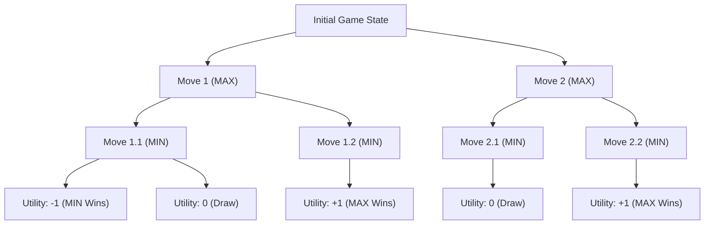

# **📖 5.2.1 The Minimax Search Algorithm**

## **📌 Introduction**
The **Minimax Algorithm** is a fundamental technique used in **two-player zero-sum games** where **both players play optimally**. The algorithm assumes:
- **One player (MAX) tries to maximize the game’s outcome**.
- **The opponent (MIN) tries to minimize MAX’s best possible outcome**.
- Both players **take turns**, and the game follows a **tree-like structure** where each move leads to a different game state.

Minimax is used in **turn-based, deterministic, perfect information games** such as:
- **Tic-Tac-Toe**
- **Chess**
- **Checkers**
- **Connect Four**
- **Go (with modifications like Monte Carlo Tree Search)**

---

## **🔹 How Minimax Works**
The algorithm evaluates the **entire game tree** to find the best possible move. The **key idea** is:
- **MAX chooses the move that leads to the highest value (best for MAX).**
- **MIN responds with the move that leads to the lowest value (worst for MAX).**
- This continues **until reaching terminal states** (win, loss, or draw).

---

## **🔹 Understanding the Minimax Tree**
A **game tree** represents all possible **moves and counter-moves**. The algorithm **propagates utility values from terminal states back to the root**.

### **Example Minimax Game Tree (Tic-Tac-Toe)**


✅ **What happens?**
1. **Terminal states** (bottom nodes) have utility values assigned:  
   - **+1** (MAX wins)  
   - **-1** (MIN wins)  
   - **0** (Draw)  
2. The values **propagate upwards**, allowing MAX and MIN to make **optimal choices**.

---

## **🔹 Steps of the Minimax Algorithm**
1. **Generate the game tree**:
   - Start from the **current game state** (root node).
   - Expand **all possible legal moves** for MAX and MIN.

2. **Assign utility values to terminal states**:
   - If MAX **wins**, assign **+1**.
   - If MIN **wins**, assign **-1**.
   - If it's a **draw**, assign **0**.

3. **Propagate values upwards**:
   - At **MIN nodes**, choose the **minimum** value from child nodes.
   - At **MAX nodes**, choose the **maximum** value from child nodes.

4. **Select the optimal move**:
   - At the **root**, MAX picks the move **leading to the highest value**.

---

## **🔹 Minimax Algorithm Pseudocode**
Below is a simple **recursive pseudocode** for the **Minimax Algorithm**.

```python
def minimax(state, depth, is_maximizing):
    if is_terminal(state) or depth == 0:
        return evaluate(state)

    if is_maximizing:
        best_value = -infinity
        for move in get_possible_moves(state):
            new_state = apply_move(state, move)
            value = minimax(new_state, depth - 1, False)
            best_value = max(best_value, value)
        return best_value
    else:  # Minimizing player
        best_value = +infinity
        for move in get_possible_moves(state):
            new_state = apply_move(state, move)
            value = minimax(new_state, depth - 1, True)
            best_value = min(best_value, value)
        return best_value
```

---

## **🔹 Time Complexity of Minimax**
- **Branching Factor (b)**: Number of possible moves per turn.
- **Depth (d)**: Number of turns the game can last.

The total number of nodes in the tree is **O(b^d)**.
- **Tic-Tac-Toe**: Small enough to evaluate completely.
- **Chess/Checkers**: Too large → needs **Alpha-Beta Pruning** for optimization.

---

## **🔹 Strengths & Weaknesses of Minimax**
### ✅ **Advantages**
✔ **Guaranteed optimal play** (if full tree is searched).  
✔ Works well in **small, perfect-information games**.  
✔ Forms the basis for **stronger AI algorithms** (e.g., Alpha-Beta Pruning, Monte Carlo Tree Search).  

### ❌ **Disadvantages**
✖ **Computationally expensive** (O(b^d)).  
✖ Doesn’t work well in **stochastic or hidden-information games** (like Poker).  
✖ Needs **heuristic evaluation functions** for deeper searches.  

---

## **🔹 Key Takeaways**
✔ **Minimax is an optimal decision-making algorithm for turn-based, zero-sum games.**  
✔ **It evaluates the full game tree** and chooses the best possible move.  
✔ **Each player alternates between maximizing and minimizing the game’s value.**  
✔ **Large games require optimizations** (e.g., **Alpha-Beta Pruning**).  

---

## **📚 Next Steps**
- Learn **Alpha-Beta Pruning (5.3)** to optimize Minimax.
- Implement **a working Minimax AI** for Tic-Tac-Toe.
- Explore **Monte Carlo Tree Search** for complex games like Go.

