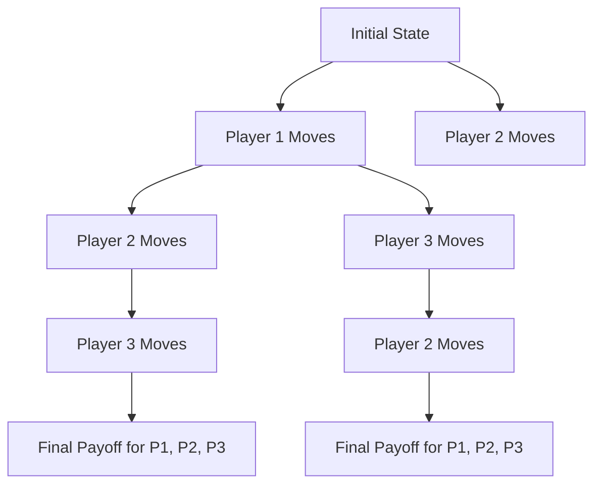

# **📖 5.2.2 Optimal Decisions in Multiplayer Games**

## **📌 Introduction**
In the previous section (5.2.1), we explored **Minimax** as a strategy for **two-player, zero-sum games** like Chess and Tic-Tac-Toe. However, many games involve **more than two players**, requiring a more complex decision-making process.

This section introduces **optimal decision-making strategies for multiplayer games**, focusing on **general-sum games**, where:
- **More than two players compete or cooperate**.
- **The game is not strictly zero-sum** (one player’s gain does not always mean another player’s loss).

Multiplayer games introduce **new challenges**, such as:
- **Coalitions and alliances** (temporary or long-term cooperation between players).
- **More complex strategy spaces** (choosing whether to attack or cooperate).

Examples of multiplayer games:
- **Poker** (multiple players competing with hidden information)
- **Settlers of Catan** (economic resource competition with trade negotiations)
- **Risk** (territory control with temporary alliances)
- **Online multiplayer strategy games** (e.g., Starcraft, Civilization)

---

## **🔹 Differences Between Two-Player and Multiplayer Games**

| Feature               | Two-Player Games (e.g., Chess) | Multiplayer Games (e.g., Poker) |
|----------------------|--------------------------------|--------------------------------|
| **Number of Players** | Exactly **two** | **Three or more** |
| **Strategy Type** | **Minimax (Zero-Sum)** | **Generalized Payoff Maximization** |
| **Win/Loss Condition** | One player wins, the other loses (zero-sum) | Players may win individually, form alliances, or cooperate |
| **Decision Complexity** | Simple evaluation (Max vs. Min) | Multiple strategies, mixed incentives |
| **Computation Complexity** | **O(b^d) (Exponential growth)** | **Higher complexity due to multiple opponents** |

### ✅ **Key Differences**
✔ In **two-player** games, each player **directly opposes** the other.  
✔ In **multiplayer** games, players may **compete, cooperate, or bluff**.  
✔ **Game trees grow much faster**, making full search impractical for large games.  

---

## **🔹 Game Theory and Multiplayer Decision Making**
When a game involves more than two players, **Minimax is no longer sufficient**. Instead, we use concepts from **Game Theory**, such as:

### **1️⃣ Nash Equilibrium** (John Nash, 1950)
- A **stable strategy profile** where **no player can improve their position by changing strategies** if others stick to theirs.
- Example: **In Poker, if everyone plays optimally, no single player benefits from unilaterally changing their strategy**.

### **2️⃣ Cooperative vs. Non-Cooperative Games**
- **Cooperative**: Players can form **alliances or coalitions**.
- **Non-Cooperative**: No alliances are allowed, and **each player acts selfishly**.

### **3️⃣ Mixed Strategies** (Probability-Based Play)
- Instead of choosing a **single deterministic move**, players assign **probabilities to different strategies**.
- Example: **In Rock-Paper-Scissors, playing randomly (33% for each move) prevents predictability**.

---

## **🔹 Game Trees for Multiplayer Games**
Multiplayer games still use **game trees**, but instead of alternating between **MAX and MIN**, we track **all players separately**.

### **Example: A Three-Player Game Tree**


✅ **What happens here?**
- The game **does not alternate between two players**.
- Each **player gets a turn** and evaluates possible outcomes.
- Instead of a **single minimax score**, we track **payoff values for all players**.

---

## **🔹 The Extended Minimax Algorithm for Multiplayer Games**

For **two-player zero-sum games**, Minimax works well. But for multiplayer games, we need to generalize it.

### **📌 Steps for Multiplayer Minimax:**
1. **Construct the game tree** with **all possible moves**.
2. **Assign a utility function** that considers **all players** (not just MAX and MIN).
3. **Each player acts in their own self-interest**, maximizing their expected outcome.
4. **The game tree propagates multiple values instead of one (vector-valued payoffs)**.

---

## **🔹 Multiplayer Minimax Pseudocode**
Below is the **extended Minimax algorithm** for multiplayer games:

```python
def multiplayer_minimax(state, depth, player_index, num_players):
    if is_terminal(state) or depth == 0:
        return evaluate(state)  # Return a list of utility values

    best_values = [-float('inf')] * num_players  # Track best outcome for all players

    for move in get_possible_moves(state, player_index):
        new_state = apply_move(state, move)
        next_player = (player_index + 1) % num_players  # Rotate to the next player
        values = multiplayer_minimax(new_state, depth - 1, next_player, num_players)

        if values[player_index] > best_values[player_index]:  # Maximizing for current player
            best_values = values

    return best_values
```

✅ **How this works:**
- Instead of just **MAX vs. MIN**, this version tracks **all players**.
- Each player **maximizes their own score**, considering what others might do.

---

## **🔹 Time Complexity of Multiplayer Minimax**
- **Two-player Minimax**: **O(b^d)**  
- **Multiplayer Minimax**: **O(b^(d * p))** (where `p = number of players`).  

🔴 **Multiplayer games grow exponentially larger**, making full searches impractical.  
✅ **Optimizations (like pruning and Monte Carlo methods) are required**.  

---

## **🔹 When is Multiplayer Minimax Used?**
| **Game**           | **Multiplayer Minimax Feasibility** | **Why?** |
|--------------------|----------------------------------|----------|
| **Tic-Tac-Toe**    | ❌ No | Only 2 players |
| **Poker**          | ✅ Yes | Bluffing, multiple players |
| **Settlers of Catan** | ✅ Yes | Trading, alliances |
| **Risk (Board Game)** | ✅ Yes | Territory control |
| **StarCraft AI**   | ✅ Yes | Complex multiplayer strategy |

---

## **🔹 Strengths & Weaknesses of Multiplayer Minimax**
### ✅ **Advantages**
✔ Works well in **strategy-based multiplayer games**.  
✔ Can model **coalitions and strategic alliances**.  
✔ Uses **game theory** concepts like **Nash Equilibrium**.  

### ❌ **Disadvantages**
✖ Computationally **more expensive** than standard Minimax.  
✖ Difficult to handle **hidden information** (e.g., Poker).  
✖ Does not consider **human psychology** (bluffing, deception).  

---

## **🔹 Key Takeaways**
✔ **Multiplayer Minimax extends two-player Minimax to multiple agents.**  
✔ **Players do not strictly alternate**; instead, each **acts in their own self-interest**.  
✔ **Utility values are vector-based**, tracking multiple payoffs.  
✔ **Game complexity increases exponentially**, requiring optimizations like **Monte Carlo Search**.  

---

## **📚 Next Steps**
- Learn **Alpha-Beta Pruning for multiplayer games**.  
- Implement **Multiplayer Minimax AI in a game like Poker**.  
- Explore **Monte Carlo Tree Search (MCTS)** for better decision-making.  

✅ **Would you like a Python implementation of Multiplayer Minimax?** 🚀
