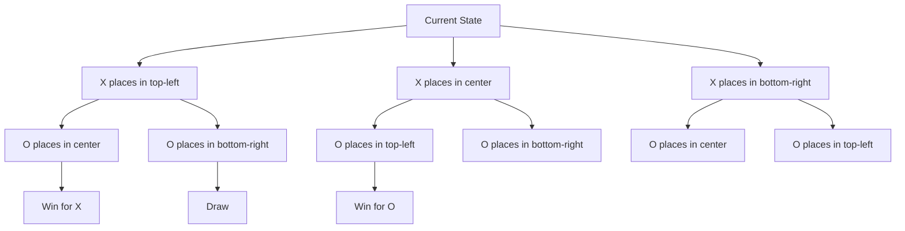

# **📖 5.2 Optimal Decisions in Games**

## **📌 Introduction**
In this section, we explore **how AI makes optimal decisions** in **two-player zero-sum games** using **game trees** and **adversarial search**. The main focus is on **how to evaluate moves strategically** by simulating possible game states.

---

## **🔹 What is an Optimal Move?**
An **optimal move** in a game is one that guarantees the best possible outcome **assuming the opponent also plays optimally**. This means:  
- AI **does not just look at the immediate best move** but considers **all possible counter-moves** from the opponent.  
- AI must evaluate **game trees** to choose the **move that leads to the best long-term result**.

### **Example: Tic-Tac-Toe**
- Suppose you are **X**, and it is your turn.
- If you have **two X's in a row**, an **optimal move** is placing your third X to **win immediately**.
- If no immediate win is available, the AI **looks ahead** to prevent the opponent from winning.

---

## **🔹 How AI Makes Decisions in Games**
AI uses **game trees** to simulate possible **future moves**.

### **What is a Game Tree?** 🌳  
A **game tree** represents **all possible moves and responses** in a game.

#### **Example: A simple Tic-Tac-Toe tree**
