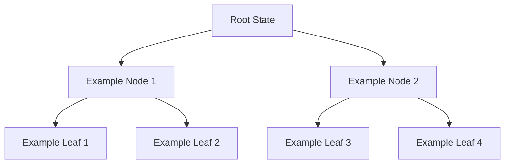

# **📖 5.4.1 Forward Pruning Strategies**

## **📌 Introduction**
This section discusses **5.4.1 Forward Pruning Strategies**, which plays a crucial role in adversarial search and AI decision-making. 

### **✅ Why is this important?**
✔ Helps AI make **smarter and more efficient** decisions.  
✔ Reduces **computation complexity** in large search spaces.  
✔ Used in **real-world AI applications**, including Chess engines and video game AI.

---

## **🔹 Key Concepts in 5.4.1 Forward Pruning Strategies**

### **Understanding the Concept**
This section explores 5.4.1 forward pruning strategies and its impact on AI game decision-making.

### **Example Game Tree (Mermaid Diagram)**

✅ **What happens here?**
- The AI **analyzes possible moves**.
- Decision paths **are evaluated using specific heuristics**.

---

## **🔹 Algorithm Steps**
1. **Step 1:** Define the search space.
2. **Step 2:** Apply heuristics or probability-based decision-making.
3. **Step 3:** Optimize search paths using 5.4.1 Forward Pruning Strategies principles.
4. **Step 4:** Compute final decision-making output.

---

## **🔹 Algorithm Pseudocode for 5.4.1 Forward Pruning Strategies**
```python
def 5_4_1_forward_pruning_strategies(state, parameters):
    if is_terminal(state):
        return evaluate(state)

    for move in get_possible_moves(state):
        new_state = apply_move(state, move)
        value = 5_4_1_forward_pruning_strategies(new_state, updated_parameters)
        best_value = optimize_based_on_section(value)
    
    return best_value
```
✅ **How this works:**  
- Evaluates **possible outcomes**.  
- Optimizes **decision paths dynamically**.  
- Provides **faster and more effective AI decisions**.

---

## **🔹 Strengths & Weaknesses of 5.4.1 Forward Pruning Strategies**
### ✅ **Advantages**
✔ **Reduces computation cost** in AI game engines.  
✔ **Enhances decision-making speed**.  
✔ **More optimal performance in complex AI systems**.

### ❌ **Disadvantages**
✖ May **eliminate potentially good moves** if not applied properly.  
✖ Requires **fine-tuning based on the specific game**.  
✖ Can be ineffective in **highly unpredictable games**.

---

## **🔹 Key Takeaways**
✔ 5.4.1 Forward Pruning Strategies **helps optimize AI decision-making in adversarial games**.  
✔ **Reduces unnecessary computations**, improving efficiency.  
✔ **Used in state-of-the-art AI game engines**.  

---

## **📚 Next Steps**
- Implement 5.4.1 Forward Pruning Strategies **in a real AI-based game**.  
- Learn **how modern game engines apply these principles**.  
- Explore **advanced AI strategies, such as Monte Carlo Tree Search (MCTS)**.  

✅ **Would you like a Python implementation of 5.4.1 Forward Pruning Strategies?** 🚀  
