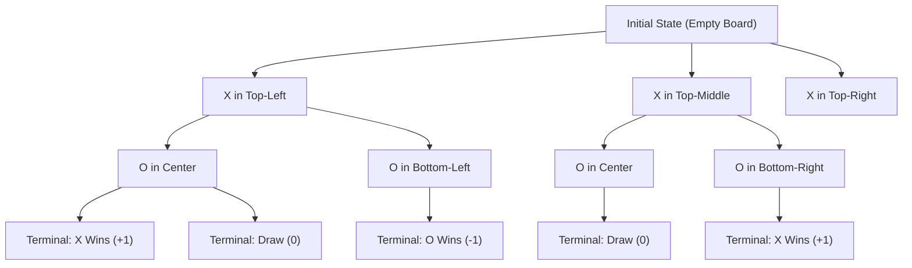
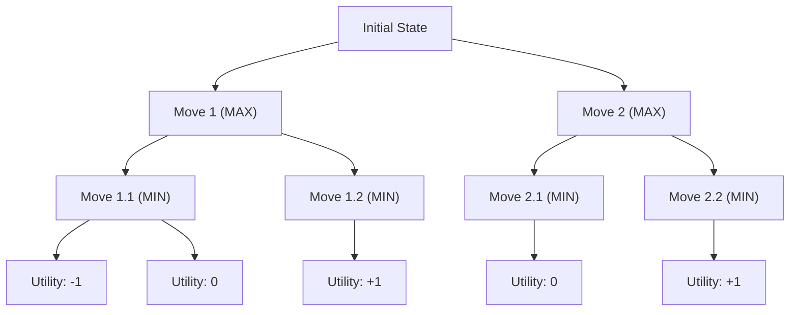
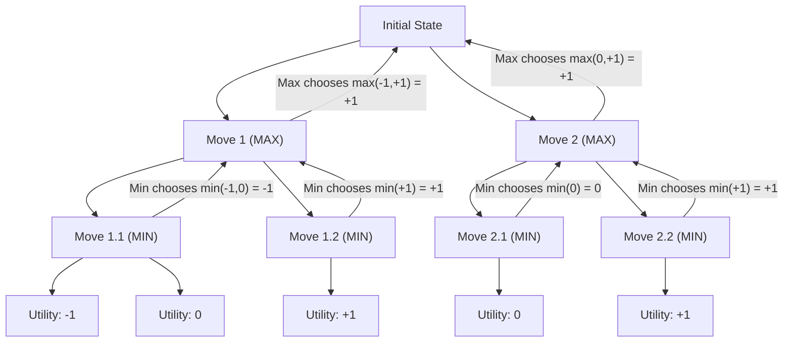
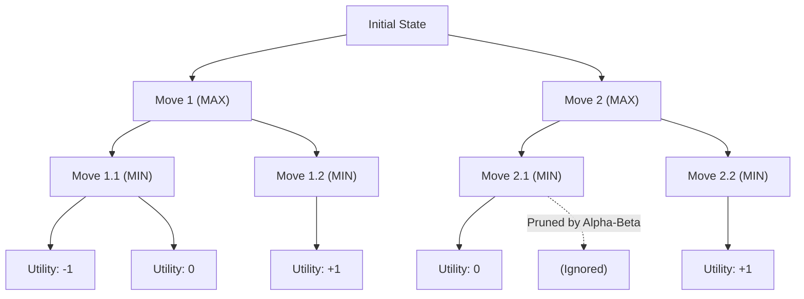
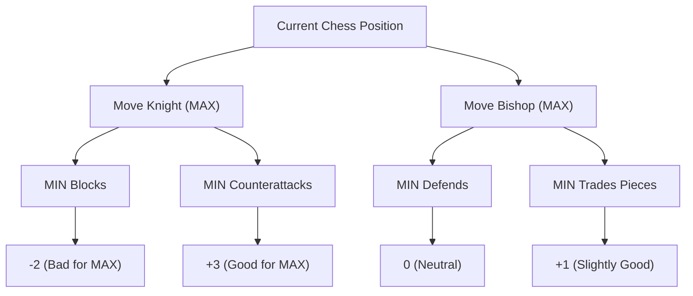

# **Notes**

## **Overview**
Figure 5.1 from *Artificial Intelligence: A Modern Approach* represents a **game tree** for a simplified version of **Tic-Tac-Toe** (Noughts and Crosses). The diagram demonstrates how:
1. **MAX (X) makes the first move**, aiming to maximize its advantage.
2. **MIN (O) responds**, attempting to minimize MAX's possible gains.
3. The game continues until a **terminal state** is reached, where one player wins, loses, or the game ends in a draw.
4. The **utility value at each leaf node** represents the **outcome from MAX’s perspective**:
   - **+1** → MAX wins.
   - **0** → Draw.
   - **-1** → MIN wins.

---

## **Key Elements in the Figure**

### **1. Game Tree Structure**
- The **root node** represents the **initial state** (an empty Tic-Tac-Toe board).
- **Each level alternates between MAX (X) and MIN (O)**, representing sequential moves.
- The **depth of the tree increases** as players make more moves.

### **2. Alternating Players**
- **MAX (Offense)**: Tries to **maximize the utility value**.
- **MIN (Defense)**: Tries to **minimize MAX's best possible score**.
- Players alternate turns until the game reaches a **terminal state**.

### **3. Terminal States**
- A **terminal state** is reached when:
  - One player gets **three marks in a row** (win).
  - The board is **completely filled** (draw).
- Each terminal state is assigned a **utility value**:
  - **+1** → MAX wins.
  - **0** → Draw.
  - **-1** → MIN wins.

### **4. Utility Values at Leaf Nodes**
- Leaf nodes of the game tree represent **final outcomes**.
- The **Minimax Algorithm** assigns these **utility values** and propagates them **back up the tree** to decide the optimal move.

---

## **Related Questions and Answers**

### **1. Is MAX short for Maximum and MIN short for Minimum?**
✅ **Yes.**  
- **MAX** tries to **maximize** the utility function (best move for itself).  
- **MIN** tries to **minimize** MAX’s best possible utility (worst-case move for MAX).  
- This naming convention is used in **game theory** and **adversarial search**.

---

### **2. What are other games like this?**
Games that share the **turn-based, zero-sum, perfect information** characteristics include:
- **Chess** ♟️
- **Checkers (Draughts)** 🏁
- **Go** ⚫⚪
- **Othello (Reversi)** 🔵⚫
- **Connect Four** ⭕❌
- **Hex** 🔺
- **Shogi (Japanese Chess)** ♜
- **Nim (Mathematical Strategy Game)** 🏗️

These games can be solved using **Minimax** and **Alpha-Beta Pruning**.

---

### **3. Does the player that makes the first move always act as MAX?**
✅ **Yes, in Minimax terminology, MAX always moves first.**  
- MAX plays **first**, aiming to maximize its utility.
- MIN **responds**, trying to minimize MAX’s best possible outcome.
- The **roles alternate**, but their objectives remain the same.

---

### **4. Is MAX offense and MIN defense?**
✅ **Yes, generally.**  
- **MAX** plays **offensively**, seeking **the best move to maximize its advantage**.  
- **MIN** plays **defensively**, blocking MAX's moves and **forcing the worst-case outcome for MAX**.  
- However, in some games (like Chess), MIN may also act offensively when it sees a chance to win.

---

### **5. Don’t their roles switch after each move?**
❌ **No, their roles do NOT switch.**  
- **MAX is always trying to maximize** the best possible utility.  
- **MIN is always trying to minimize** MAX's best possible outcome.  
- Even though MIN actively makes moves, it **does not become MAX** because the game tree is always evaluated **from MAX’s perspective**.

---

### **6. Is the first move always offensive, and the second move always defensive?**
✅ **Typically, yes.**  
- The **first move (MAX)** is often an **aggressive or strategic placement**.  
- The **second move (MIN)** is often **a defensive counter-move**, blocking MAX’s best options.  
- However, **in deeper game states, both players can play offensively or defensively**, depending on their strategy.

---

## **Conclusion**
Figure 5.1 illustrates:
- The structure of **adversarial search**.
- How **utility values propagate** in a **game tree**.
- The **foundation for Minimax and Alpha-Beta Pruning**.

Understanding this diagram helps in building **AI for turn-based strategy games**, optimizing **search algorithms**, and designing **rational agents in competitive environments**.

---

## Tic-Tac-Toe Game Tree (Partial)

✅ **What this shows**:

- **MAX (X) plays first** and places X in various positions.
- **MIN (O) responds defensively or aggressively**.
- The **utility values** at the leaf nodes show **who wins**.

---

## **2️⃣ Minimax Game Tree Example**
💡 **Minimax Algorithm** works by propagating values **up the tree**, choosing the **best move** for MAX and the **worst move** for MIN.

✅ What this shows:

- MAX’s turn (choosing best value).
- MIN’s turn (choosing worst case for MAX).
- Propagating utility values back up the tree.

---

## 3️⃣ Minimax with Utility Propagation

🔄 How Minimax Works:

- MAX always picks the highest utility from MIN’s moves.
- MIN always picks the lowest utility to minimize MAX’s advantage.

---

✅ What this shows:

- MIN always chooses the lowest utility available.
- MAX always chooses the highest utility available.
- This is how Minimax makes optimal decisions.

---

## 4️⃣ Alpha-Beta Pruning (Efficiency Optimization for Minimax)

🚀 Alpha-Beta Pruning skips unnecessary branches when it knows certain moves won’t affect the outcome.

✅ What this shows:

- If one branch already proves to be worse, we don’t need to explore it.
- Saves computation time and speeds up decision-making.

---

## 5️⃣ Chess Example with Minimax

♟️ Minimax also applies to Chess. Here’s an example game tree with Chess-like moves:

✅ What this shows:

- Chess moves can be analyzed using Minimax.
- The best move is chosen based on the evaluated utility.

---

## Key Takeaways

- **Minimax** makes decisions based on best & worst possible moves.
- **Alpha-Beta Pruning **speeds up decision-making by cutting out unnecessary calculations.
- This applies to games like Chess, Checkers, Tic-Tac-Toe, and Go.
- Game Trees show all possible future moves & consequences.