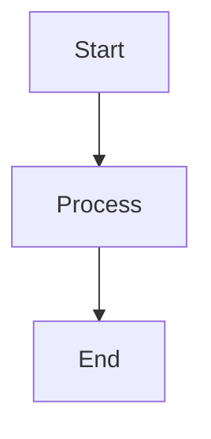

# 6.1.1 Variables, Domains, and Constraints

This section explores 6.1.1 variables, domains, and constraints in artificial intelligence.

## Key Concepts
- Explanation of the topic
- Examples
- Algorithms

