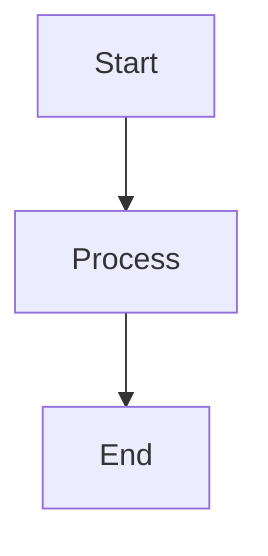

# 6.1 Defining Constraint Satisfaction Problems

This section explores 6.1 defining constraint satisfaction problems in artificial intelligence.

## Key Concepts
- Explanation of the topic
- Examples
- Algorithms

