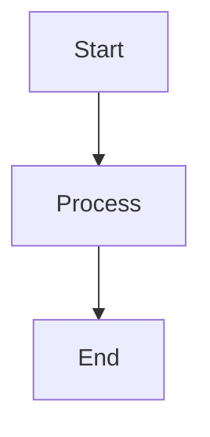

# 6.2.4 k-Consistency

This section explores 6.2.4 k-consistency in artificial intelligence.

## Key Concepts
- Explanation of the topic
- Examples
- Algorithms

```mermaid
graph TD;
  A[Start] --> B[Process] --> C[End]
```
