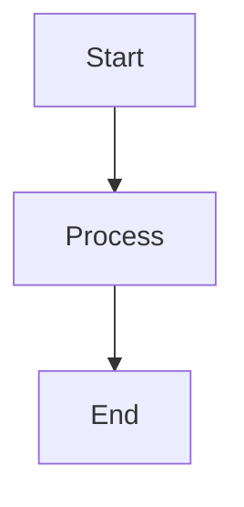

# 6.2 Constraint Propagation: Inference in CSPs

This section explores 6.2 constraint propagation: inference in csps in artificial intelligence.

## Key Concepts
- Explanation of the topic
- Examples
- Algorithms

