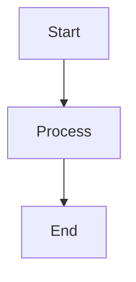

# 6.3.3 Intelligent Backtracking

This section explores 6.3.3 intelligent backtracking in artificial intelligence.

## Key Concepts
- Explanation of the topic
- Examples
- Algorithms

```mermaid
graph TD;
  A[Start] --> B[Process] --> C[End]
```
