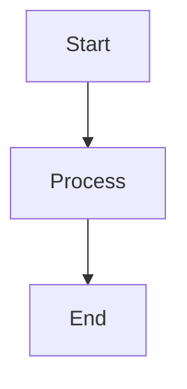

# 6.4 The Structure of Constraint Satisfaction Problems

This section explores 6.4 the structure of constraint satisfaction problems in artificial intelligence.

## Key Concepts
- Explanation of the topic
- Examples
- Algorithms

