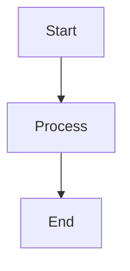

# 6.5.2 Cryptarithmetic and Logic Puzzles

This section explores 6.5.2 cryptarithmetic and logic puzzles in artificial intelligence.

## Key Concepts
- Explanation of the topic
- Examples
- Algorithms

